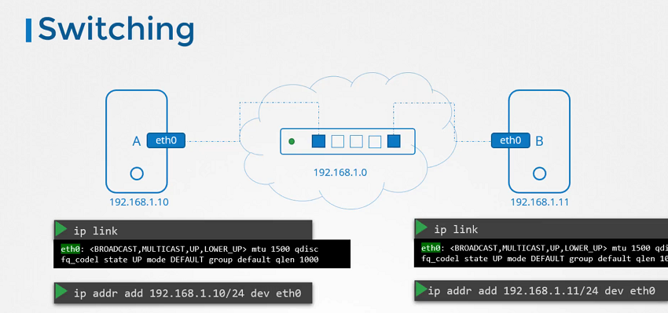
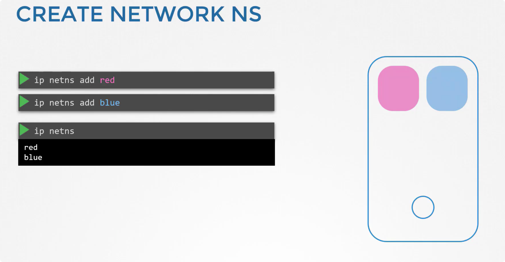
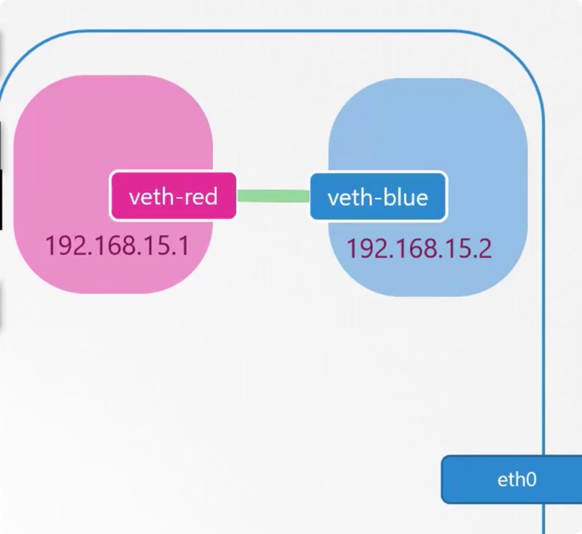
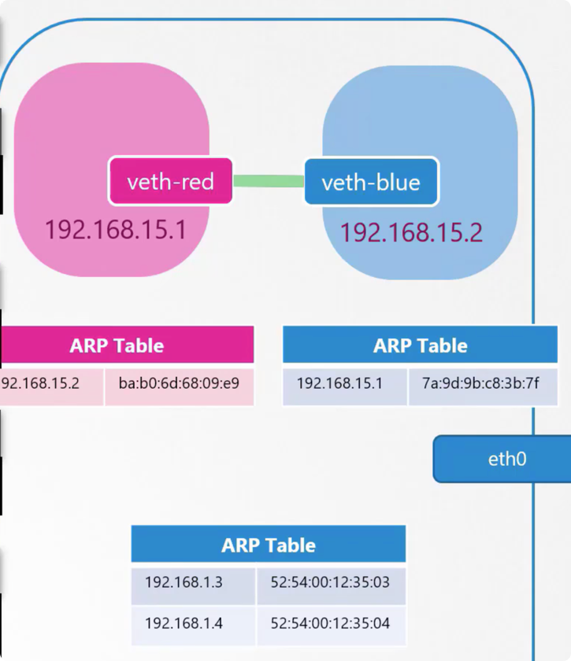
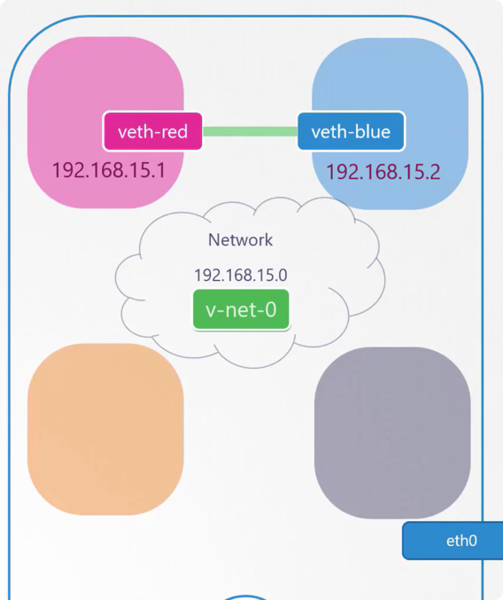
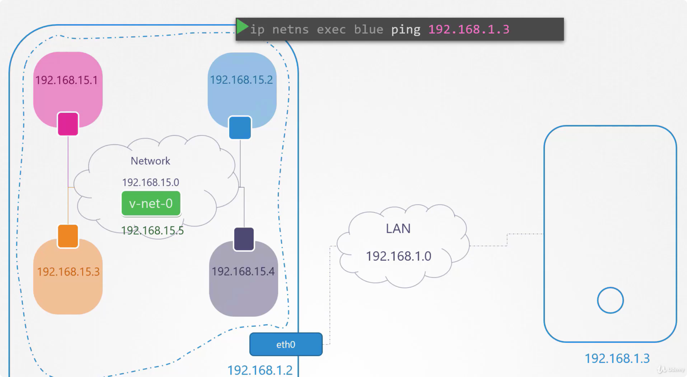

## ip

[ip](https://linux.die.net/man/8/ip)

### NAME

ip - show / manipulate routing, devices, policy routing and tunnels


### SYNOPSIS

> ip [ OPTIONS ] OBJECT { COMMAND | help }

> OBJECT := { link | addr | addrlabel | route | rule | neigh | tunnel | maddr | mroute | monitor }

> OPTIONS := { -V[ersion] | -s[tatistics] | -r[esolve] | -f[amily] { inet | inet6 | ipx | dnet | link } | -o[neline] }

### OBJECT


#### address or addr

protocol (IP or IPv6) address on a device.

protocol (IP or IPv6) address on a device.
  
##### address add

add new protocol address.
      
#### link

network device

##### link add


#### netns

network namespace

#### route 

Manipulate route entries in the kernel routing tables keep information about paths to other networked nodes.
 
  


### EXAMPLES

- Two hosts A and B
  - host A has interface (eth0) 
  - host B has interface (etho0)
  - We want to connect the two hosts A and B using the switch.
  - Let's assume it has the IP address 192.168.1.0
    
  - To see the interfaces on the host we use the following command
    ```bash
    $ $ ip link
      1: lo: <LOOPBACK,UP,LOWER_UP> mtu 65536 qdisc noqueue state UNKNOWN mode DEFAULT group default qlen 1000
          link/loopback 00:00:00:00:00:00 brd 00:00:00:00:00:00
      2: ens4: <BROADCAST,MULTICAST,UP,LOWER_UP> mtu 1460 qdisc mq state UP mode DEFAULT group default qlen 1000
          link/ether 42:01:0a:80:00:26 brd ff:ff:ff:ff:ff:ff
    ```

  - To see the IP Address interfaces.
    ```bash
    $ ip address
    1: lo: <LOOPBACK,UP,LOWER_UP> mtu 65536 qdisc noqueue state UNKNOWN group default qlen 1000
        link/loopback 00:00:00:00:00:00 brd 00:00:00:00:00:00
        inet 127.0.0.1/8 scope host lo
           valid_lft forever preferred_lft forever
        inet6 ::1/128 scope host 
           valid_lft forever preferred_lft forever
    2: ens4: <BROADCAST,MULTICAST,UP,LOWER_UP> mtu 1460 qdisc mq state UP group default qlen 1000
        link/ether 42:01:0a:80:00:26 brd ff:ff:ff:ff:ff:ff
        inet 10.128.0.38/32 scope global dynamic ens4
           valid_lft 3020sec preferred_lft 3020sec
        inet6 fe80::4001:aff:fe80:26/64 scope link 
           valid_lft forever preferred_lft forever
    ```

 - We then assign the systems with IP addresses on the same network. 
   For this, we use the command ip addr. 
   - On host A
   ```bash
   $ ip addr add 192.168.1.10/24 dev eth0
   ```
   - On host B
   ```bash
   $ ip addr add 192.168.1.10/24 dev eth0
   ```
 
   
   
   Once the links are up, and the IP addresses are assigned,
   The computers can now communicate with each other through the switch. 
   The switch can only enable communication within the network which means 
   it can receive packets from a host on the network and deliver it to other
   systems within the same network.
   - So now the ping command from host A should work
   ```bash
    ping 192.168.1.11
   ```

- How does System B with the IP 192.168.1.11 reach system C with the IP 2.10 on the
  other network. That’s where a Router comes in. A Router helps connect two networks together. 
  Since it connects to the two separate networks, it gets two IPs assigned. One on each network. 
  In the first network we assign it an IP address 192.168.1.1 and in the second we assign it an 
  IP 192.168.2.1. Now we have a router connected to the two networks that can enable communication 
  between them.
  
  

- Now, when system B tries to send a packet to system C, how does it know where the router is on the network
  to send the packet through the router is just another device on the network.
  there could be many other such devices. That’s where we configure the systems with a gateway or a route.
  If the network was a room, the gateway is a door to the outside world to other networks or to the internet
  The systems need to know where that door is to go through that to see the existing routing configuration
  on a system run the [route](../route/route.md) command. It displays the kernels routing table

- To configure a gateway on system B to reach the systems on network 192.168.2.0, 
  run the ip route add command, and specify that you can reach the
  192.168.2.0 network through the door or gateway at 192.168.1.11. Running the route
  command again shows that we have a route added to reach the 192.168.2.0 series network through the
  router. 
  - So we run the folloiwng command on system B
  ```bash
  $ ip route add 192.168.2.0/24 via 192.168.1.1
  ```
  - So when we run the `route` command on system B again we get
  ```bash
  $ route
  Kernel IP routing table
  Destination  Gateway      Genmask         Flags     Metric  Ref  Use   Iface
  192.168.2.0  192.168.1.1  255.255.255.0   UG        0       0    0     eth0   
  ```
  - Similarly we can add a route to the internet as well.
  ```bash
  $ ip route add default via 192.168.1.1  
  ## OR 
  $ ip route add 0.0.0.0 via 192.168.1.1  
  ```
  
- To view the routes in a host

```bash
$ ip route
default via 10.128.0.1 dev ens4 proto dhcp src 10.128.0.38 metric 100 
10.128.0.1 dev ens4 proto dhcp scope link src 10.128.0.38 metric 100 
```


- Create a network namespace

```bash
$ ip netns add red

$ ip netns add blue
```

- List the network namespace

```bash
# ip netns
red
blue
```



- List the network interfaces on the host

```bash
$ ip link
1: lo: <LOOPBACK,UP,LOWER_UP> mtu 65536 qdisc noqueue state UNKNOWN mode DEFAULT group default qlen 1000
    link/loopback 00:00:00:00:00:00 brd 00:00:00:00:00:00
2: ens4: <BROADCAST,MULTICAST,UP,LOWER_UP> mtu 1460 qdisc mq state UP mode DEFAULT group default qlen 1000
    link/ether 42:01:0a:80:00:26 brd ff:ff:ff:ff:ff:ff
```

- Exec inside the network namespace. Note that you cannot see the
  `ens4` interface inside the network namepace.
```bash
$ ip netns exec red ip link
1: lo: <LOOPBACK> mtu 65536 qdisc noop state DOWN mode DEFAULT group default qlen 1000
    link/loopback 00:00:00:00:00:00 brd 00:00:00:00:00:00

### OR

$ ip -n red  link
1: lo: <LOOPBACK> mtu 65536 qdisc noop state DOWN mode DEFAULT group default qlen 1000
    link/loopback 00:00:00:00:00:00 brd 00:00:00:00:00:00
```

- Similarly you can run the arp command on the host and inside the network namespace


```bash
### On the host
$ arp
Address                  HWtype  HWaddress           Flags Mask            Iface
_gateway                 ether   42:01:0a:80:00:01   C                     ens4

## inside the namespace
$ ip netns exec red arp
```

- To create a virtual cable with two interfaces on either end

```bash
$ ip link add veth-red type veth peer name veth-blue
```

- The next step is to attach each interface to the appropriate namespace

```bash
$ ip link set veth-red netns red
```

- Similarly, attach the blue interface to the blue namespace.

```bash
$ ip link set veth-blue netns blue
```

- We can then assign IP addresses to each of these names faces.
  We will use the usual IP ADR command to assign the IP address, 
  
```bash
$ ip -n red addr add 192.168.15.1 dev veth-red
```

- Similarly assign the IP address to the blue namespace

```bash
$ ip -n blue addr add 192.168.15.2 dev veth-blue
```

- We then bring up the interface using the IP link, set up command for each device within the respective
  namespace 

```bash
$ ip -n red link set veth-red up
$ ip -n blue link set veth-blue up
```



- Now try to ping blue namespace from red

```bash
$ ip netns exec red ping 192.168.15.2
```

- You can check the ARP table of the red namespace

```bash
$ ip netns exec red arp
```




- What do you do when you have more of them?
  How do you enable all of them to communicate with each other?
  Just like in the physical world, you create a virtual network inside your host, create a network,
  you need a switch. So to create a virtual network.
  You need a virtual switch.
  So you create a virtual switch within our host and connect the namespace us to it.

  - interfaces on host before we create anything new
  
  ```bash
  $ ip link
    1: lo: <LOOPBACK,UP,LOWER_UP> mtu 65536 qdisc noqueue state UNKNOWN mode DEFAULT group default qlen 1000
        link/loopback 00:00:00:00:00:00 brd 00:00:00:00:00:00
    2: ens4: <BROADCAST,MULTICAST,UP,LOWER_UP> mtu 1460 qdisc mq state UP mode DEFAULT group default qlen 1000
        link/ether 42:01:0a:80:00:26 brd ff:ff:ff:ff:ff:ff
  ```
  
  - we will use the Linux Bridge option to create an internal bridge network.
    We add a new interface to the host using the IP link. 
    
  ```bash
  $ ip link add v-net-0 type bridge
  ```
    
  - Interfaces after we have created v-net-0
  
  ```bash
  $ ip link
    1: lo: <LOOPBACK,UP,LOWER_UP> mtu 65536 qdisc noqueue state UNKNOWN mode DEFAULT group default qlen 1000
        link/loopback 00:00:00:00:00:00 brd 00:00:00:00:00:00
    2: ens4: <BROADCAST,MULTICAST,UP,LOWER_UP> mtu 1460 qdisc mq state UP mode DEFAULT group default qlen 1000
        link/ether 42:01:0a:80:00:26 brd ff:ff:ff:ff:ff:ff
    5: v-net-0: <BROADCAST,MULTICAST> mtu 1500 qdisc noop state DOWN mode DEFAULT group default qlen 1000
        link/ether ea:dd:c0:38:b0:fc brd ff:ff:ff:ff:ff:ff
  ```
  
  - It's currently down. So you need to turn it up
  
  ```bash
  $ ip link set dev v-net-0 up
  ```

    
    
  - Now for the namespace.  
    This interface is like a switch that it can connect to.
    So think of it as an interface for the host and a switch for the namespace.
    
  - Earlier we created the cable or `veth peer`  with the veth-red interface on one end and veth blue interface on
    another because we wanted to connect the two namespaces directly.
    Now we will be connecting all namespaces to the bridge network, so we need new cables for that purpose.
    This cable doesn't make sense anymore, so we will get rid of it.  
    When you delete one end (veth-red) the other end gets deleted automatically.
    
  ```bash
  $ ip -n red link del veth-red
  ```

  - Let's crete a new cable with one end as veth-red and other end as veth-red-br as it connects to the
    bridge network. Similarly create one for the blue namespace
  
  ```bash
  $ ip link add veth-red type veth peer name veth-red-br
  $ $ ip link add veth-blue type veth peer name veth-blue-br
  ```

  - Now attach one end of the cable to the red namespace and other end to v-eth-0 where v-eth-0 is the master
  - Repeate the for the blue namespace
  ```bash
  $ ip link set veth-red netns red
  $ ip link set veth-red-br master v-eth-0
  $ ip link set veth-blue netns blue
  $ ip link set veth-blue-br master v-eth-0    
  ```

  - Let us assin the IP addresses for these links and turn them up
  
  ```bash
  $ ip -n red addr add 192.168.15.1 dev veth-red
  $ ip -n blue addr add 192.168.15.2 dev veth-blue
  $ ip -n red link set veth-red up
  $ ip -n blue link set veth-blue up
  ```
    


  - Now the host has the IP address 192.168.1.2, if it tries to ping on of these interfaces it would fail as they
    are on different networks. The bridge switch is actually a network interface for the host and we can assign an 
    IP address to it. Once assigned, we can now ping the red namespace `ping 192.168.15.1` from the host
    
  ```bash
  $ ip addr add 192.168.15.5/24 dev v-net-0
  ```

- Say there is another host attached to our network with the address 190.168.1.3
  How can I reach this host from within my name spaces?

  

  - So we need to add an entry into the routing table to provide a gateway or door to the outside world.
    So how do we find that gateway?
    A door or a gateway, as we discussed before, is a system on the local network that connects to the
    other network.
    
  - What is a system that has one interface on the network local to the blue namespace, which is the 192.168.1.15 
    network and is also connected to the outside LAN network
    
  - Remember, our local host has an interface to attach to the private network so you can ping the namespaces.
    So our localhost is the gateway that connects the two networks together. So we can add the following route entry
    in the bluenamespace
    
    ```bash
    $ ip netns exec blue ip route add 192.168.1.0/24 via 192.168.15.5
    ```
    
  - We need NAT enabled on our host acting as the gateway here so that it can send the messages to the LAN
    in its own name with its own address.
    
    - You should do that using IP tables, add a new rule in the net IP table, in the post routing chain to
      masquerade or replace the from address on all packets coming from the source network 
      192.168.15.0 with its own IP address.
      That way, anyone receiving these packets outside the network will think that they're coming from the
      host and not from within. When we try to ping now `ping 192.168.1.3` we will see that we are able to receive a response
    
  ```bash
  $ iptables -t nat -A POSTROUTING -s 192.168.15.0/24 -j MASQUERADE
  ```

  - Now how do we reaach the internet from the blue namespace
    We can simply say that to reach any external network, talk to our host so we add a default gateway
    specifying our host.
  
  ```bash
  $ ip netns exec blue ip route add default via 192.168.15.5
  ```