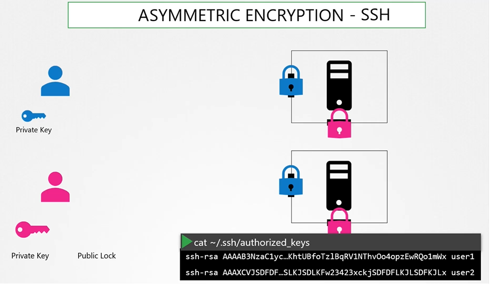
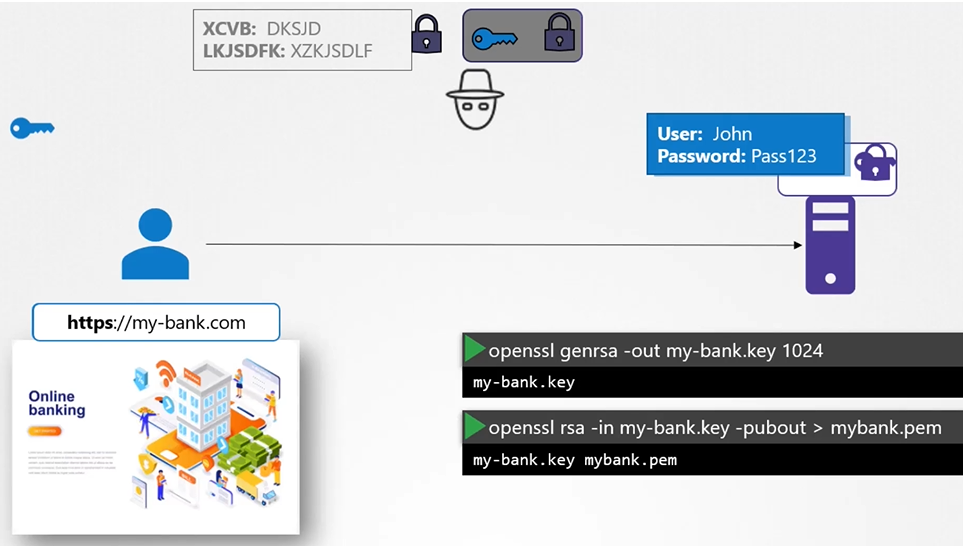
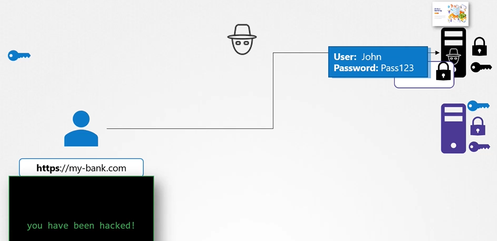
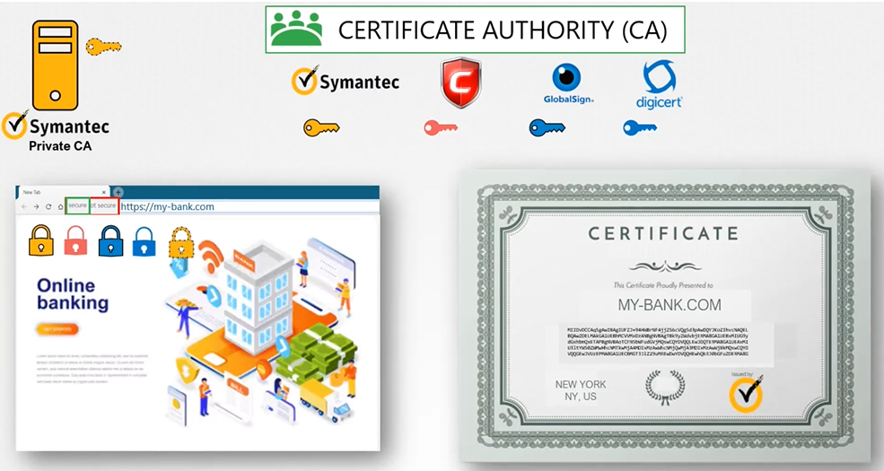

# TLS Basics
  
In this section, we will take a look at TLS Basics

## Certificate
- A certificate is used to guarantee trust between 2 parties during a transaction.
- Example: when a user tries to access web server, tls certificates ensure that the communication between them is encrypted.

  
  
  
## Symmetric Encryption
- It is a secure way of encryption which uses the same key to encrypt and decrypt the data.
- This key has to be exchanged between the sender and the receiver.
- There is a risk of a hacker gaining access to the key and decrypting the data.

  
  
## Asymmetric Encryption
- Asymmetric encryption uses a pair of keys a private key and a public key.
- But for the sake of this example we will call it a private key and a public lock.
- Private key which is only with me.So it's private. A lock that anyone can access. So it's public.
- The trick here is if you encrypt or lock the data with your lock you can only open it with the associated
  key. 
- So your private key must always be secure with you and not be shared with anyone else.
- Sincce the lock is public and may be shared with others but they can only lock something with it no matter
  what is locked. It can only be unlocked by your private key
  

**SSH**

**let’s look at an even simpler use case of securing SSH access to servers through key pairs.** 
  
- You have a server in your environment that you need 
  access to. 
- You don't want to use passwords as they're too risky. 
- So you decide to use key pairs you generate a public and private key pair. 
- You can do this by running the ssh_keygen command. It creates two files. 
  id_rsa is the private key and id_rsa.pub is the public key. 
- Well, not a public key, a public lock. 
- You then secure your server by locking down all access to it, except through a door that is locked 
  using your public lock. 
- It's usually done by adding an entry with your public key into the servers. 
  .ssh authorized_keys file. 
- So you see the lock is public and anyone can attempt to break through. 
- But as long as no one gets their hands on your private key which is safe with you on 
  your laptop no one can gain access to the server.
- When you try to SSH you specify the location of your private key in your SSH command.

  

- What if you have other servers in your environment. How do you secure 
  more than one server with your key pair? 
- Well you can create copies of your public lock and place them on as many servers as you want. 
- You can use the same private key to SSH into all of your servers securely. 
- What if other users need access to your servers well they can do the 
  same thing.
- They can generate their own public and private key pairs.
  As the only person who has access to those servers, you can create an additional 
  door for them and lock it with their public locks by copying their public 
  locks/keys to all the servers. And now other users can access the servers 
  using their private keys.
  
  
  
**Let's go back to our Web server example.**
- You see the problem we had earlier with symmetric encryption was that the key used to encrypt 
  data had to be sent to the server over the network along with the 
  encrypted data. And so there is a risk of the hacker getting the 
  key to decrypt the data.
  
- What if we could somehow get the key to the server safely. Once the key
  is safely made available to the server, the server and client can safely
  continue communication with each other using symmetric encryption. 
- To securely transfer the symmetric key from the client to the server, 
  we use Asymmetric Encryption. So, we generate a public and private key 
  pair ON THE SERVER. 
  
- We're going to refer to the public lock as public key going forward 
  now that you have got the idea that. The ssh-keygen command we used 
  earlier creates a pair of keys for SSH purposes. 
  So the format is a bit different. Here we use the openssl command to 
  generate a private and public key pair. And that’s how they look.
  
  

- When the user first accesses the web server using https, he gets the public key 
  from the server. 
- Since the hacker is sniffing all traffic that is assumed he too 
  gets a copy of the public key. We'll see what he can do with it. 
- The user. In fact the user's browser then encrypts the symmetric key 
  using the public key provided by the server. 
- The symmetric key is now secure the user then sends this to the server. 
  The hacker also gets a copy. 
- The server uses the private key to decrypt the message and retrieve the symmetric key
  from it. 
- However the hacker does not have the private key to decrypt and 
  retrieve the symmetric key from the message it received the hacker 
  only has the public key with which he can only lock or encrypt a message 
  and not decrypt the message
- The symmetric key is now safely available only to the user and the server 
  They can now use the symmetric key to encrypt data and send to each other.
  The receiver can use the same symmetric key to decrypt data and retrieve information. 
- The hacker is left with the encrypted messages and public keys with which he can decrypt any data with 
  asymmetric encryption. 
- We have successfully transferred the symmetric keys from the 
  user to the server and what's symmetric encryption. We have secured all 
  future communication between them. 
  
**Perfect the hacker now looks for new ways to hack into our account**
- So he realizes that the only way he can get your credential is by getting 
  you to type it into a form he presents. So he creates a Web site that looks 
  exactly like your bank's web site. The design is the same. 
  The graphics are the same. The Web site is a replica of the actual bank's Web site. 
- He hosts the website on his own server. He wants you to think it's secure
  too. So he generates his own set of public and private key pairs and 
  configure them on his web server. 
- And finally he somehow manages to tweak your environment or your network to 
  route your requests going to your bank's web site to his servers. When you 
  open up your browser and type the website address in you see a very familiar 
  page the same login page of your bank that you're used to seeing. 
- So you go ahead and type in the username and password. You made sure you 
  typed in HTTPS in the URL to make sure that communication is secure encrypted 
- Your browser receives the key and you send encrypted symmetric key and 
  then you send your credentials encrypted with the key and the receiver 
  decrypt the credentials with the same symmetric key you've been communicating securely 
  in an encrypted manner but with the hackers server. As soon as you send in 
  your credentials, you see a dashboard that doesn’t look very much like 
  your bank's dashboard. You have been hacked!
  
  
  
  
**So what do we do?**
- What if you could look at the key you received from the server and see if it 
  is a legitimate key from the real bank server. When the server send the key it does not send 
  the key alone. It sends a certificate that has the key in it.   
  
- If you take a closer look at the certificate you will see that it is like an actual certificate. 
  But in a digital format it has information about who the certificate 
  is issued to, the public key of that server, the location of that server etc. 
  
**How do you look at a certificate and verify if it is legit?**
- who signed and issued the certificate.
- If you generate the certificate then you will have it sign it by yourself; that is known as self-signed certificate.

    
  
- on the right you see the output of an actual certificate every certificate 
  has a name on it the person or subject to whom the certificate is issued to. 
  That is very important as that is the field that helps you validate their 
  identity. 
- If this is for a web server this must match what the user types 
  in on his browser. If the bank is known by any other names and 
  if they like their users to access their application with the other names 
  as well then all those names should be specified in the certificate under 
  the subject alternative name section. 
  
- But you see anyone can generate a certificate like this. You could generate one for yourself saying you're 
  Google and that's what the hacker did in this case. He generated a 
  certificate saying he is your bank's web site. 
- So how do you look at a certificate and verify if it is legit?

- That is where the most important part of the certificate comes into play who's signed and issued the 
  certificate. If you generate the certificate then you will have to sign 
  it by yourself. That is known as a self signed certificate. Anyone looking 
  at the certificate you generated will immediately know that it is not a 
  safe certificate because you have signed 
- If you looked at the certificate you received from the hacker closely you would have noticed that it was a 
  fake certificate that was signed by the hacker himself. As a matter of fact 
  your browser does that for you. 
- All of the web browsers are built in with a Certificate validation mechanism, wherein the browser checks the certificate 
  received from the server and validates it to make sure it is legitimate if 
  it identifies it to be a fake certificate then it actually warns you. 
- So then how do you create a legitimate certificate for your web servers that 
  the web browsers will trust. 
  
- How do you get your certificates signed by someone with authority. That’s where Certificate Authorities or CAs comes in. 
  They are well known organizations that can sign and validate your certificates 
  for you. Some of the popular ones are Symantec, Digicert, Comodo, 
  GlobalSign etc. 

**How do you generate legitimate certificate? How do you get your certificates singed by someone with authority?**
- That's where **`Certificate Authority (CA)`** comes in for you. Some of the popular ones are Symantec, DigiCert, Comodo, GlobalSign etc.

  
  
  
  
  
  
- The way this works is you generate a certificate signing a 
  request or CSR using the key you generated earlier and the domain name of 
  your Web site. You can do this again using the open SSL command. 
  This generates a `my-bank.csr` file which is the certificate signing 
  request that should be sent to the CA for signing. The 
  certificate authorities verify your details and once it checks out they 
  sign the certificate and send it back to you. 
  
- You now have a certificate signed by a CA that the browser trust. If hacker tried to get his 
  certificate signed the same way he would fail during the validation 
  phase and his certificate would be rejected by the CA. So the Web site 
  that he's hosting won't have a valid certificate. The CAs use different 
  techniques to make sure that you are the actual owner of that domain. 
  
**But how do the browsers know that the CA itself was legitimate?**
  
- For example what if the certificate was signed by a fake CA. In this case 
  our certificate was signed by Symantec. How would the browser know Symantec 
  is a valid CA and that the certificate was infact signed by Symantec and 
  not by someone who says they are semantec. 
  
- The CA is themselves have a set of public and private key pairs. 
  The CA is use their private keys to sign the certificates. The public keys 
  of all the CAs are built in to the browsers. The browser uses the public key of the CA to 
  validate that the certificate was actually signed by the CA themselves. 
  
- You can actually see them in the settings of your web browser, under certificates. 
  They are under trusted CAs tab. Now these are public CAs that help us ensure 
  the public websites we visit, like our banks, email etc are legitimate. 
  
**However they don't help you validate sites hosted privately say within your organization** 
  
- For example, for accessing your payroll or internal email applications. 
  For that you can host your own private CAs. Most of these companies listed 
  here have a private offering of their services. 
- A CA server that you can deploy internally within your company. You can then have the public key of 
  your internal CA server installed on all your employees browsers and 
  establish secure connectivity within your organization.
  
**So let's summarize real quick**
- We have seen why you may want to encrypt messages being sent 
  over a network to encrypt messages. 
- We use asymmetric encryption with a pair of public and private keys and 
  admin uses a pair of keys to secure SSH connectivity to the servers. 
- The server uses a pair of keys to secure HTTPS traffic. For this the server 
  first sends a certificate signing request to a CA. The CA uses its private key 
  to sign the CSR. 
- Remember all users have a copy of the CAs public key (in their browsers). 
  The signed certificate is then sent back to the server. 
- The server hosts  the web application with the signed certificate. 
- Whenever a user accesses the web application the server first sends the certificate 
  with its public key. 
- The user or rather the user's browser reads the certificate 
  and uses the CA's public key to validate and retrieve the server's public key.
- It then generates a symmetric key that it wishes to use going forward for all communication. 
  The symmetric key is encrypted using the server's public key and sent back 
  to the server the server which uses its private key to decrypt the message and 
  retrieve the symmetric key. 
- The symmetric key is used for communication 
  going forward.

**In Short**
- So the administrator generates a key pair for securing SSH. 
- The web server generates a key pair for securing the web site with HTTPS, 
- the Certificate Authority generates its own set of key pair to sign 
  certificates. 
- The end user though only generates a single symmetric key. 
- Once he establishes trust with the Web site he uses his username and 
  password to authenticate the Web server with the servers key pairs.
  
   
**Is it over now ?**
- The client was able to validate that the server is who they say they 
  are but the server does not for sure know if the client is who they say 
  they are. It could be a hacker impersonating a user by somehow gaining access 
  to his credentials not over the network for sure. 
- As we have secured it already with TLS. May be some other means. 

**Anyway, So what can the server do to validate that the client is who they say they are?** 

- for this as part of the initial trust building exercise. The server can request a certificate from the client 
  and so the client must generate a pair of keys and a signed certificate from a valid CA. 
- The client then sends the certificate to the server for it to verify that the client is who they say they are.  
- Now you must be thinking, you have never generated a client's certificate to access a Web site. 
- Well that's because TLS client certificates are not generally implemented on web servers even if they are it's all implemented under the hood. 
- So in normal user don't have to generate and manage certificates manually so that was the final piece about client certificates 

This whole infrastructure including the CA the servers the people and the process of generating distributing and maintaining digital certificates is known as public key infrastructure or PKI.
**Public Key Infrastructure**

   
   
   
- I've been using the analogy of a key and lock for private and public keys. 
- If I give you the impression that only the lock or the public key can encrypt data then please forgive me as it's not true. 
- These are in fact two related or paired keys. You can encrypt data with any one of them and only decrypt data with the other. 
- You cannot encrypt data with one and decrypt with the same. 
- So you must be careful what you encrypt your data with. If encrypted data with your private key then remember anyone 
  with your public key which could really be anyone out there will be able to decrypt and read your message. 

  
  
  

  

  

   
## Certificates naming convention

Finally, a quick note on naming convention. 
- Usually certificates with Public key are named crt or pem extension. So that’s server.crt, server.pem 
  for server certificates or client.crt or client.pem for client certificates. 

- And private keys are usually with extension .key, or –key.pem. For example server.key or server-key.pem. 
  So just remember private keys have the word ‘key’ in them usually either as an extension or in the name of the 
  certificate and one that doesn't have the word key in them is usually a public key or certificate.

  
  
  
Credits
- [certified-kubernetes-administrator-course](https://github.com/kodekloudhub/certified-kubernetes-administrator-course)
  
  

  
   

  
  
  

  
  
  
  
  
  

  
  
